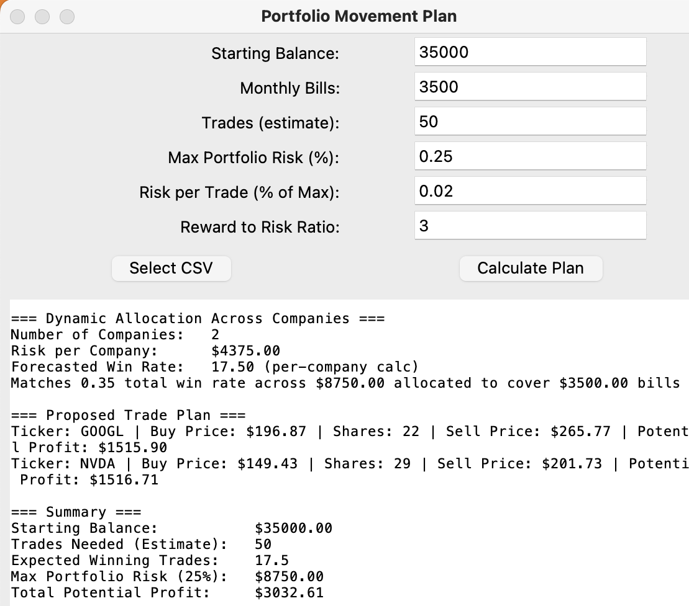

# Portfolio Movement Plan with GUI


This project is a Python-based portfolio management tool with a graphical user interface (GUI) built using **Tkinter**. It allows you to calculate a portfolio movement plan centerted around monthly bills, including potential profits, required win rates, and trade risk management. The application integrates with a CSV file containing tradeable companies and their buy prices.

---

## Features

1. **Interactive GUI**  
   - Input parameters like starting balance, monthly bills, risk percentages, and reward-to-risk ratio.  
   - Select or import a CSV file containing company tickers and buy prices.

2. **Dynamic Calculations**  
   - Determines the required number of trades and win rates to meet your financial goals.  
   - Computes potential profits and maximum losses based on user inputs.

3. **CSV Integration**  
   - Reads a CSV file (`companies_to_trade.csv`) containing columns `ticker` and `buy_price`.  
   - You can dynamically load or switch to a different CSV during runtime.

4. **Modular Code**  
   - Logic functions (`calculate_trades_to_goal`, `build_trade_plan`, etc.) are decoupled from the GUI.  
   - Easy to extend or customize for different trading strategies.

---

## File Overview

- **`portfolio_gui.py`**  
  Main entry point with a Tkinter GUI. Users can input their trading parameters, select a CSV file of companies, and calculate a trade plan.

  - **Key Functions**  
    - `calculate_trades_to_goal(starting_balance, risk_per_trade, win_rate)`  
      \- Determines how many trades are needed to meet a goal, plus how many of those are expected to win.  
    - `match_win_rate_to_bills(monthly_bills, trades_per_month, risk_per_trade, reward_to_risk)`  
      \- Calculates the required win rate to cover monthly bills or a monthly financial goal.  
    - `build_trade_plan(companies, risk_per_company, win_rate)`  
      \- Given a list of companies (from CSV), allocates risk and calculates potential profits.  
    - `import_from_csv(csv_filename)`  
      \- Reads a CSV with columns `ticker,buy_price` and returns a list of dicts.  
    - `risk_to_reward_calculations(risk_amount)`  
      \- Shows possible reward targets at 1:1, 2:1, 3:1, and 4:1 multiples.  

- **`companies_to_trade.csv`** (example)  
  - A sample CSV file listing companies and their buy prices:
    ```csv
    ticker,buy_price
    AMZN,215.0
    TGT,139.0
    NVDA,225.5
    ```
  - This can be updated manually or via another script (e.g., `closingprice.py`) if you want live data.

- **`closingprice.py`** *(optional)*  
  - If you want to dynamically update the CSV with the latest closing prices from an API like `yfinance`, you might include a function like:
    ```python
    def update_closing_prices(tickers, csv_filename):
        # fetch and write latest close to csv
        ...
    ```
  - Then, call it in `portfolio_gui.py` before initializing the GUI so that `companies_to_trade.csv` is always fresh.

---
## How to Run

    Clone or Download this repository so you have `portfolio_gui.py` and a sample `companies_to_trade.csv`.

    If you plan to do live price updates (optional), create or adapt `closingprice.py`.

**Launch the GUI by running**:

## Requirements

- **Python 3.7+** (for modern Tkinter and CSV handling)
- **Tkinter** (usually bundled with Python)
- **Optional**: `yfinance` if you plan to fetch live prices in `closingprice.py`


***Install any needed packages (only if you use a live data script)***


## In the GUI window:

- Enter or adjust the parameters in the labeled entry fields , Click Select CSV to browse for your `companies_to_trade.csv` if it is not in the default location.
- Click **Calculate Plan** to generate a detailed summary of trades, profit potential, and required win rates.

---

## Example Flow

1. **Open** the script in a terminal or IDE:
   




## COLLABORATION

- **Author**: Robert Smith
- **License Type**: MIT License
- **License Details**: Full details of the MIT License can be found above.

